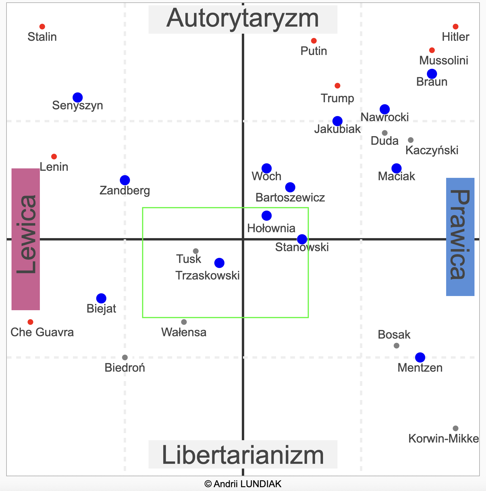

# Polityczny Kompas

Code samples to help my understand my political views

## 2025

Mainly based on upcoming Presidential Elections in Poland.

v1

## Tech stack

React + ReCharts (`<ScatterChart>`, `<CartesianGrid>`, `<ReferenceLine>`, etc.)

- https://recharts.org/
- https://recharts.org/en-US/examples/SimpleScatterChart

## Other codebases, inspired

- https://github.com/greygatch/political-compass/
- https://github.com/AUTOMATIC1111/llm-political-compass
- https://github.com/experience-experiments/react-easy-chart DEPRECATED

## Resources

- https://en.wikipedia.org/wiki/Political_spectrum
- https://rationalwiki.org/wiki/Political_Compass
