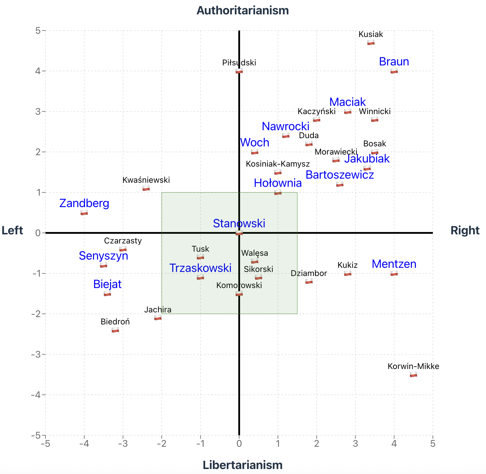
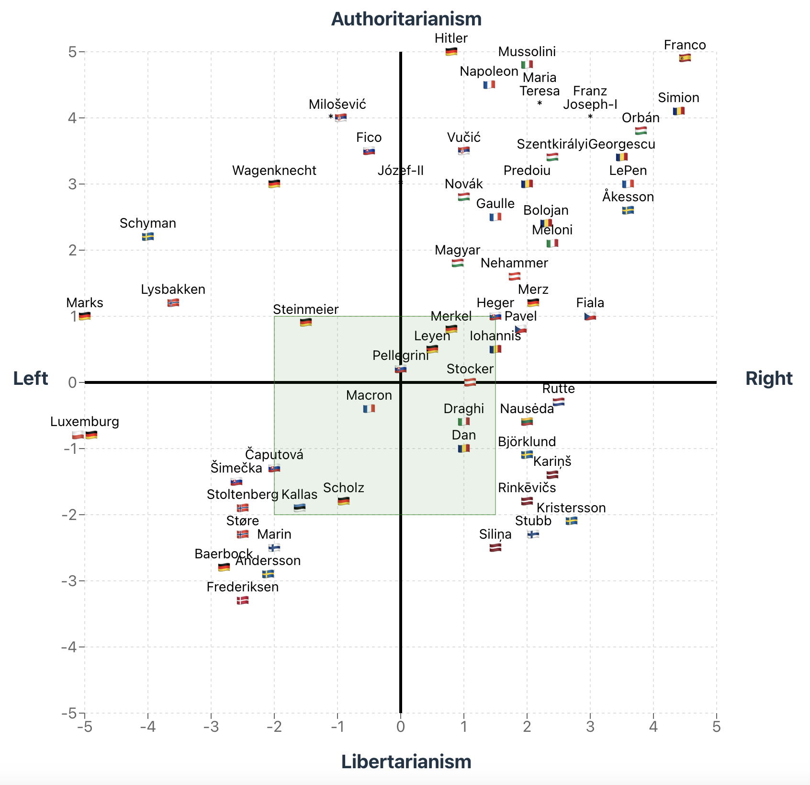
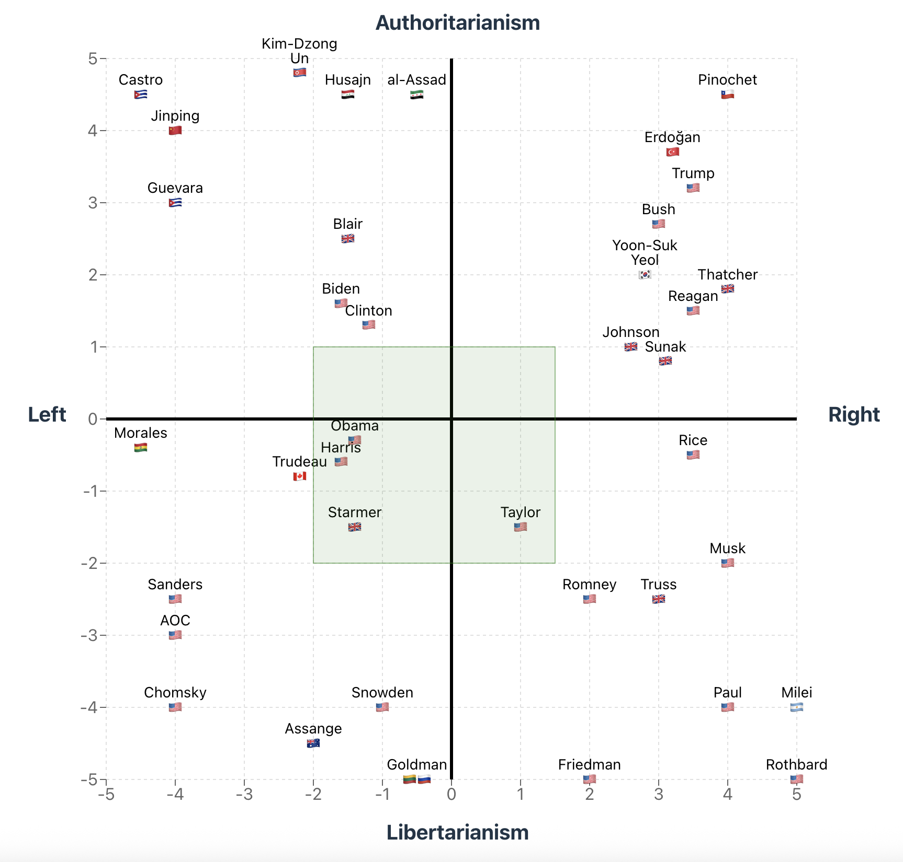
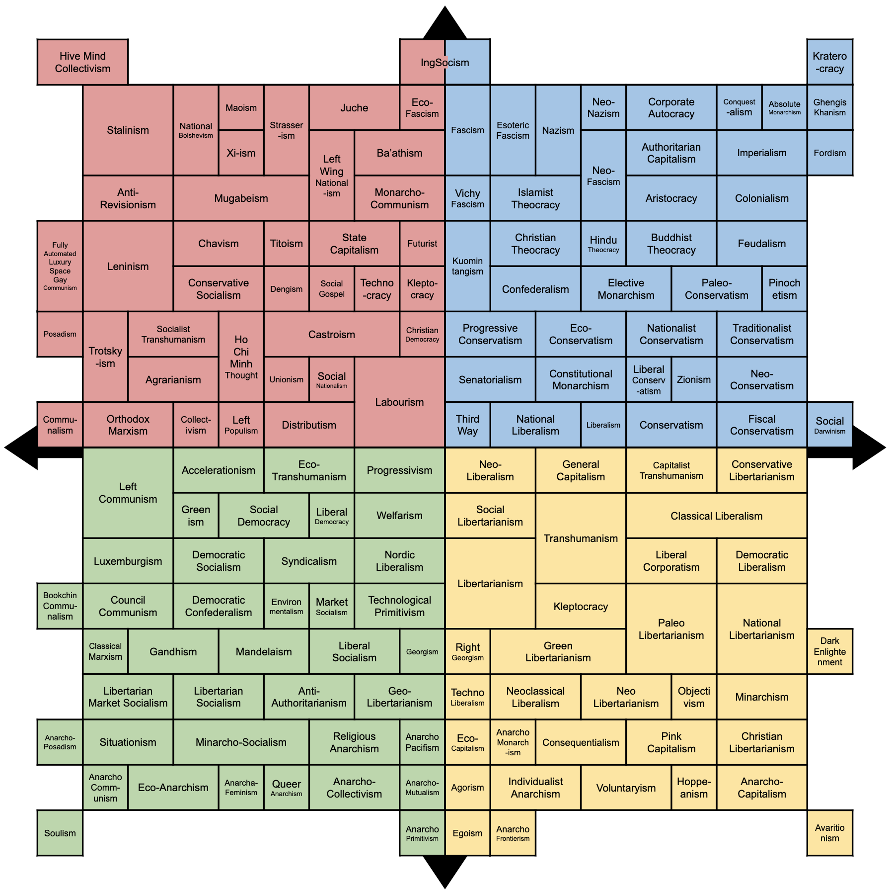
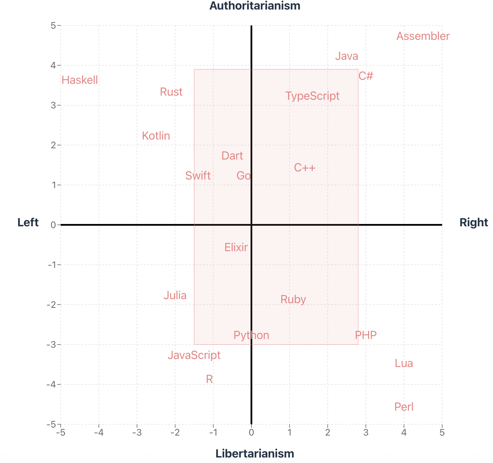

# Polityczny Kompas

Political compass to help my understand my political views:

- Left, axis `-x`
- Right, axis `+x`
- Libertarianism, axis `-y`
- Authoritarianism, axis `+y`

Green rectangle is "my political views" area. Other dots represent political people I somehow know.

And [here](https://alundiak.github.io/polityczny-kompas/politica.html) is previous, my initial very basic version using basic HTML/SVG.

## Reason/Goal

Because of Presidential Elections in Poland 18-May-2025 I decided to create a political compass to review candidates views.

- https://en.wikipedia.org/wiki/2025_Polish_presidential_election

But as I always liked politics, and I like to dive deeper into political views on myself, I decided to extend this political compass with wider spectrum comparing all geo-political people I somehow know.

Most complicated is to define exact number in the scale from `[-5; +5]`, because not always people have definitive political views and spectrum is "tricky" sometimes.

## Other Political resources:

- Forgot from where I get this, I think it was from [here](https://www.reddit.com/r/PoliticalCompassMemes/comments/fvghtl/comment_what_you_are_and_we_can_debate_why_youre/) - 2020 version

- But [here](https://www.reddit.com/r/PoliticalCompassMemes/comments/13jel85/where_do_you_stand/) is another, 2023 version and looks like more detailed:

- https://en.wikipedia.org/wiki/Political_spectrum
- https://rationalwiki.org/wiki/Political_Compass
- I also use [ChatGPT](https://chatgpt.com/) to research and compare people's political view. But it is sometimes very wrong, so need to be always cautious and double check facts personally.

## Tech stack

- React
- ReCharts (`<ScatterChart>`, `<CartesianGrid>`, `<ReferenceLine>`, `<ReferenceArea>` etc.)
  - https://recharts.org/en-US/examples/SimpleScatterChart
  - https://codesandbox.io/p/sandbox/recharts-referencearea-with-a-custom-shape-iwp2j
  - Jul-2025 UPDATED.
    - `recahrts@3.0.2` is weird. I didn't expect so many issues. Follow https://github.com/recharts/recharts/releases and Upgrade later Autumn-2025.
    - `recahrts@3.1.0` also behaves differently.
- [TailwindCSS](https://tailwindcss.com)

## Kinda inspired by

- https://www.politicalcompass.org/
- https://github.com/greygatch/political-compass/
- https://github.com/AUTOMATIC1111/llm-political-compass
- https://github.com/experience-experiments/react-easy-chart DEPRECATED

## Political Quizzes

- https://cdw.edu.pl/kompas/kompas-pogladow/ ([mój wynik](https://cdw.edu.pl/kompas/kompas-pogladow/?res=24214452245123405444))
- https://latarnikwyborczy.pl/ankieta ([mój wynik](https://latarnikwyborczy.pl/s/32f02ef8db))

## Got somethings new in technical experience

- ReCharts experience.
- Touch to Light/Dark theme support CSS coding
- `SVG` restrictions with emojis and fonts. Corporate or Windows laptops may NOT render flag-emojis, as result need to re-think a fallback.

## Bonus. Polityczny kompas języków programowania

