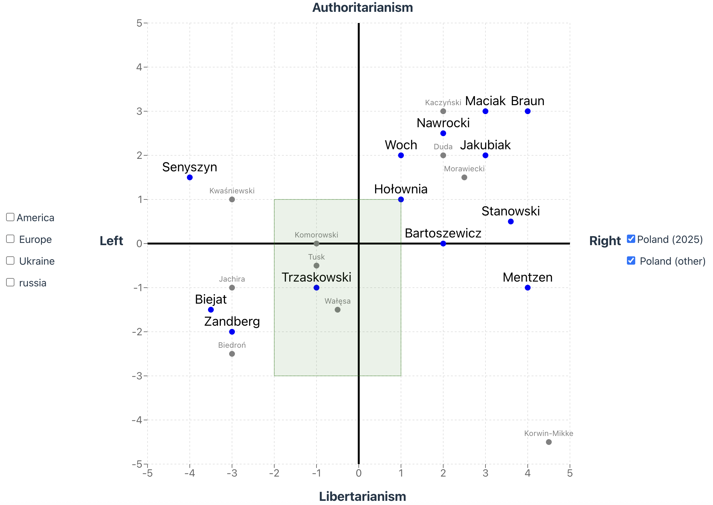

# Polityczny Kompas

Political compass to help my understand my political views:

- Left, axis `-x`
- Right, axis `+x`
- Libertarianism, axis `-y`
- Authoritarianism, axis `+y`

Green rectangle is "my political views" area. Other dots represent political people I somehow know.

## Versions

v2 - React + ReCharts version

v1 - [basic, HTML/SVG version](https://alundiak.github.io/polityczny-kompas/politica.html)

## 2025

Mainly based on upcoming Presidential Elections in Poland.

- https://en.wikipedia.org/wiki/2025_Polish_presidential_election

## Other Political resources:

- https://en.wikipedia.org/wiki/Political_spectrum
- https://rationalwiki.org/wiki/Political_Compass

## Tech stack

- React
- ReCharts (`<ScatterChart>`, `<CartesianGrid>`, `<ReferenceLine>`, `<ReferenceArea>` etc.)
  - https://recharts.org/
  - https://recharts.org/en-US/examples/SimpleScatterChart
  - https://codesandbox.io/p/sandbox/recharts-referencearea-with-a-custom-shape-iwp2j

## Other codebases, inspired

- https://github.com/greygatch/political-compass/
- https://github.com/AUTOMATIC1111/llm-political-compass
- https://github.com/experience-experiments/react-easy-chart DEPRECATED
